# EC500 iOS Intro
An example project for how to make an iOS app.  This repo is for EC500 C1 - Agile software development.  

## We will be demoing:
* The basics of making an iOS app
* How to use either google+ or facebook login API to create a user 
* Potentially more in the future, read on..

## First Sprint Instructions:
* Below are detailed steps and screenshots to guide you on your iOS development mission!

###Steps
These instructions are for creating an iOS app with a Facebook login using Xcode as the IDE and swift as the programming language.
####Step 1 - Setup Project

Welcome to Xcode! In order to develop for iOS you will need access to a computer running an up to date version of OS X.  Once you have access to an appropriate operating system install and open up Xcode, the Apple App IDE.

Start Xcode and create a new project via File -> New -> Project

You'll want to follow along with the screen shots to know which options to select.  In the first menu select iOS -> Application -> Single View App
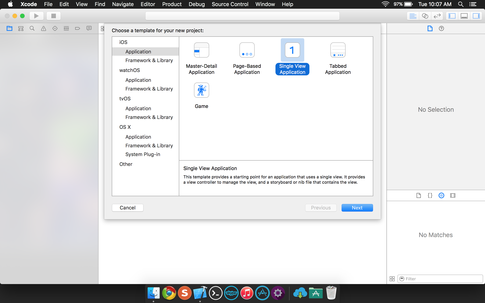

On this next screen you'll want to enter any information about the project to configure it properly.  For the purpose of this tutorial we will be using the more modern iOS development language, Swift.
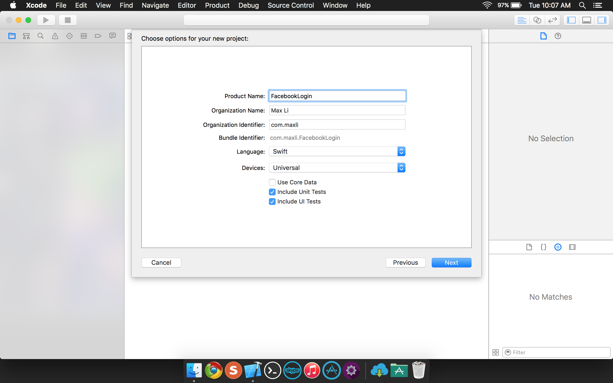

It's as simple as that! Hit create to specify where to save your new project.  Xcode also allows for integrating your project into a git repository, I highly recommend you play around with this option for ease of access and use accross your team and your devices.
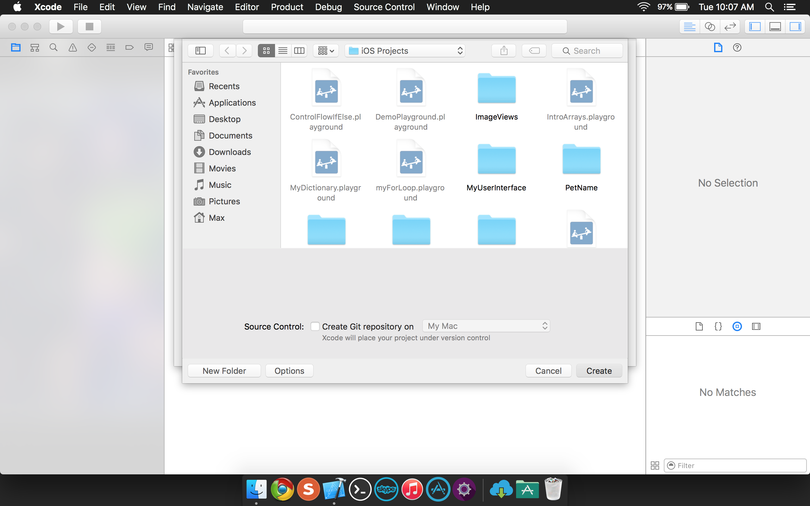

####Step 2 - Setup Project

Next we are going to jump into our existing iOS app.  Our app will be a simple facebook login that will call out to the Facebook login protocol using the Facebook API.
The API provided by facebook will allow you to utilize a number of authentication protocols once you are logged in.  So lets see how to log in!

Select the project folder which should be listed as the app name in your default folder.  You'll see below we have also downloaded into our Documents folder the FacebookSDK for convenience in the same path.  We will be copying some of these files/libraries into our project.

Below you'll see some of our .swift code file for the app.  A lot of this will be generated for you automatically on the creation of the project and you will notice the code is a lot like python.  If you are interested in learning swift in depth I highly recommend the following as both a walkthrough and a reference:
https://learnxinyminutes.com/docs/swift/
What is notable on this screen is to make sure and import the FBSDKCoreKit.  If you are interested in it parse through the code and you will see it reads almost like plain text.
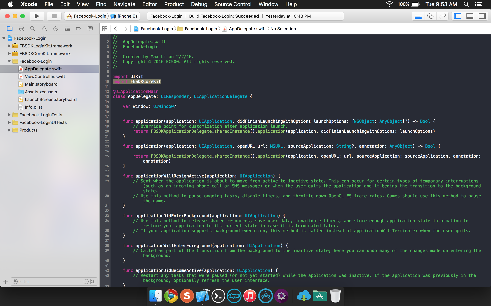

On our ViewController.swift you will see more of our front end code including landing screens when interacting with our app.  All code is opensource and can be found in this repository.
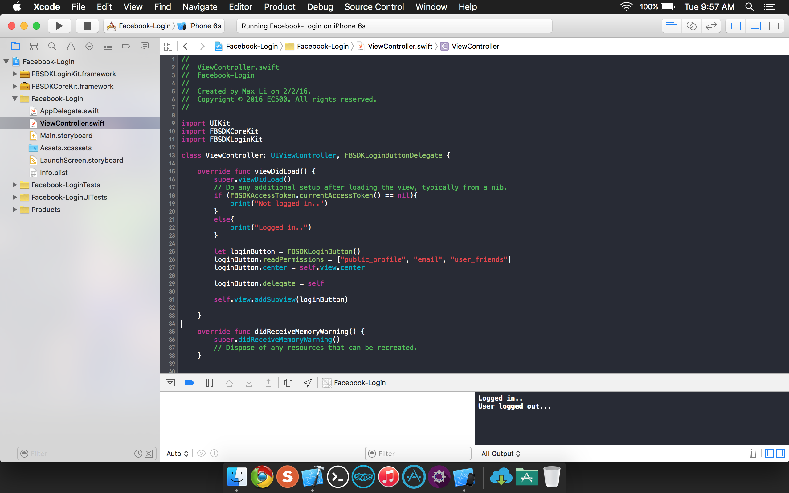

Another notable feature of the Xcode IDE is the console in the lower right corner.  Before you go into full emulation mode for testing you will be able to do basic debugging and testing using the console i/o here.
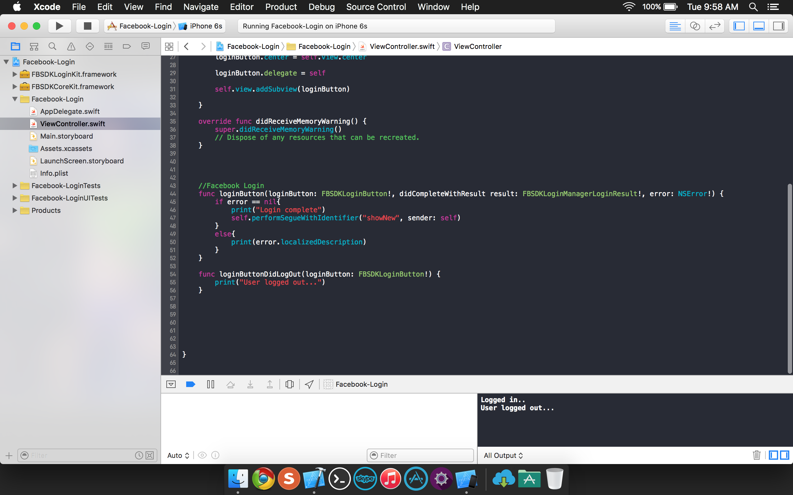

Through the .storyboard of your project you can get a little bit more of a graphical view of the flow of your application.  This is very useful for understanding flow of your program.
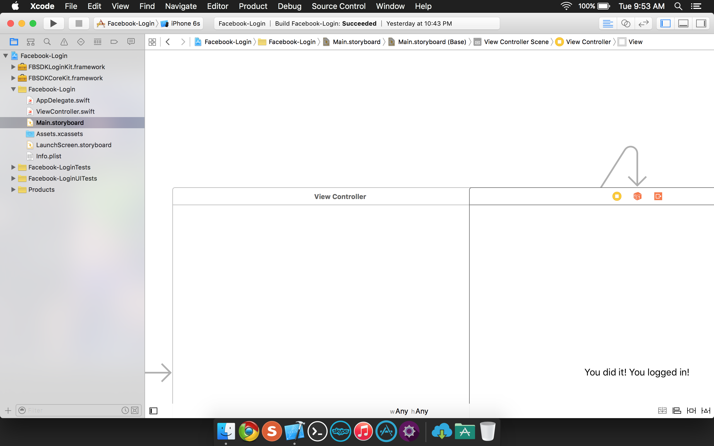

Another slightly better view of the storyboard..
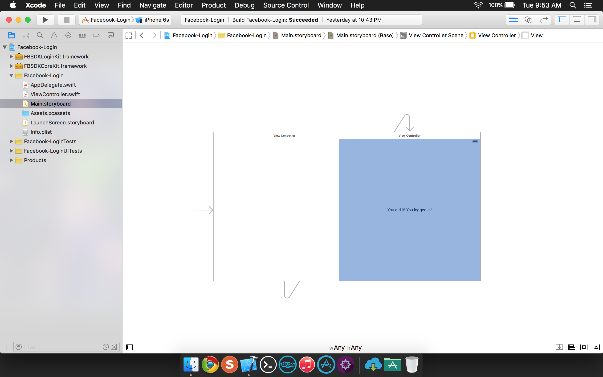

When your ready to test out start up the iOS device emulator.  Select which device you want to emulate and enjoy the mock-up iPhone screen.  Here is ours:

When you click the sign-in on facebook button the app will either call out to the FB app if you have it or take you to a facebook preferences window in your safari app to have you authenticate and log-in:

Here you will see a screen that says we have already authorized EC500 app to have access to our facebook account info.  Pressing ok to continue..
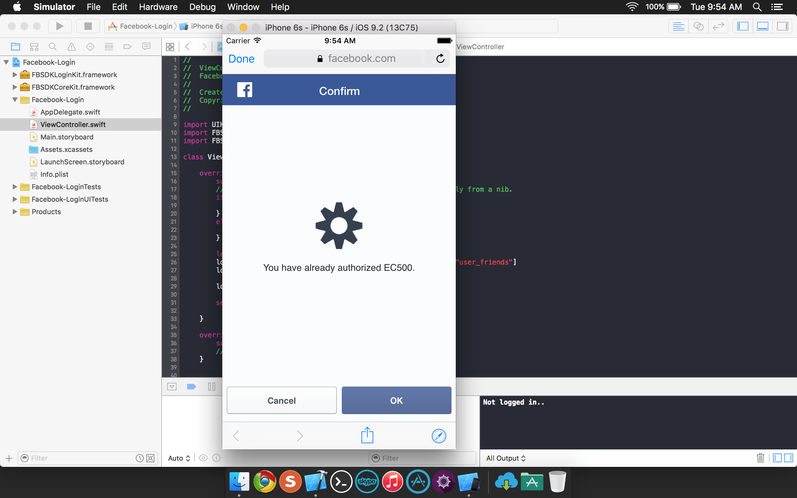

This takes you back to our amazing app, where once you are authenticated.. TADA! You are now logged in - good job!
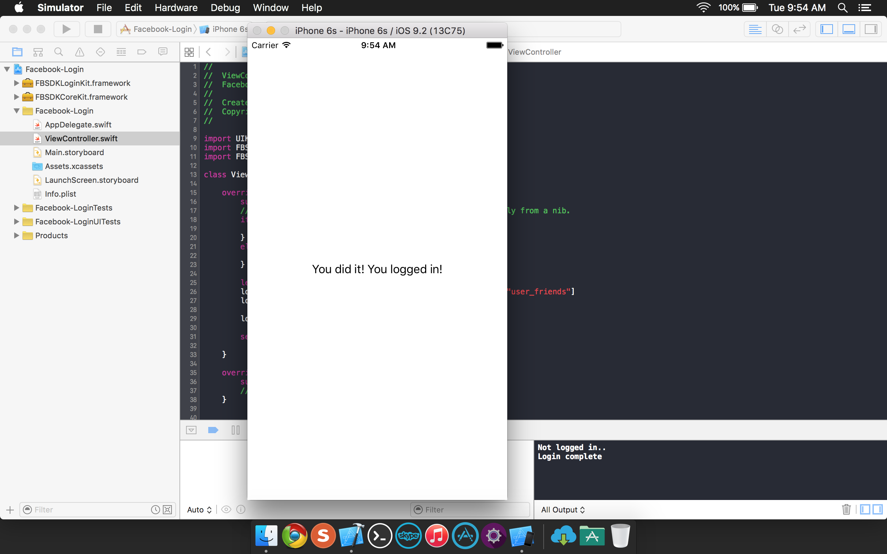

Once logged in we added a screen with a log out button to demonstrate proof of concept that you are in fact logged in and authenticated using the proper info:
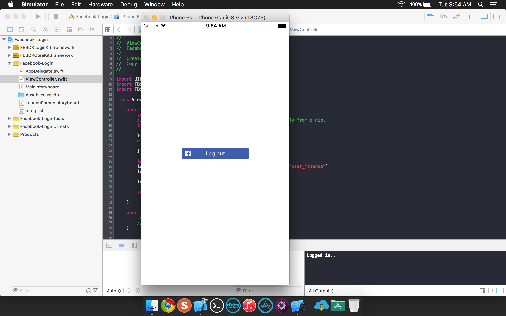

And finally, you will see that our test guinea pig Max has successfully authenticated and the API is correctly pulling his facebook account information:
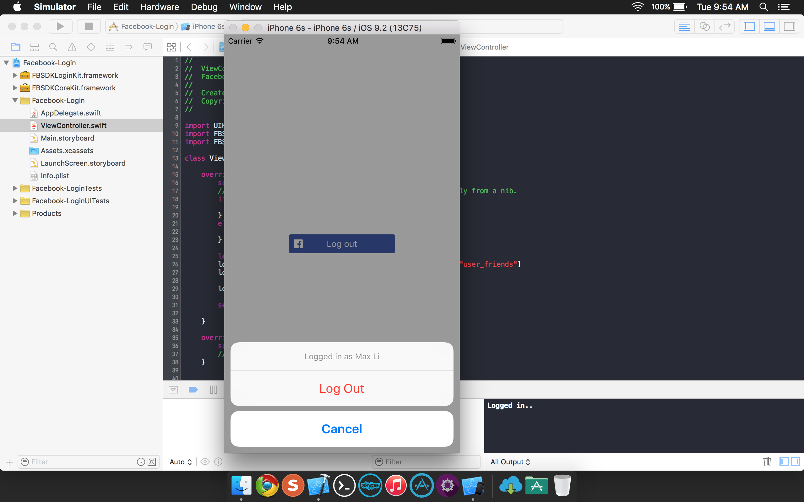

So that is it! After this is all set you can now design your sweet apps with Facebook authentication!! You're welcome!!

### Additional Tutorial Links:
https://www.youtube.com/watch?v=cpANieebE2M
There is also a great tutorial when you first sign up for your unique iOS developer code
